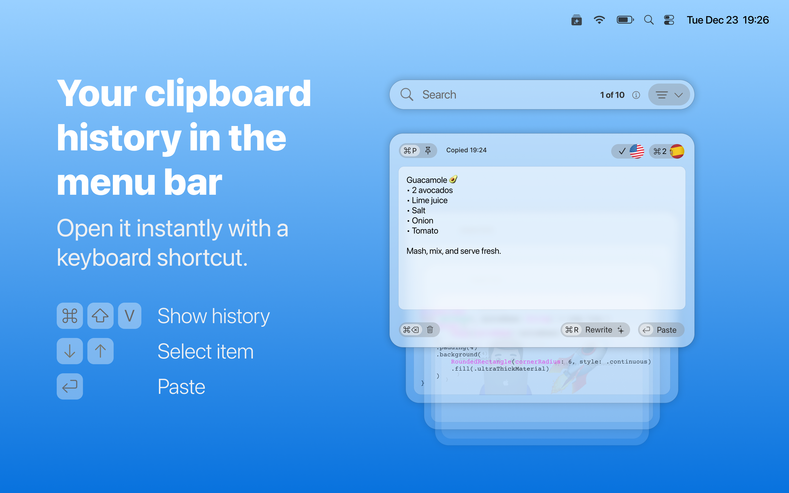

# Better Clipboard

Better Clipboard is a native macOS clipboard manager focused on fast history, pinned items, translation, and thoughtful content handling.

<a href="./Promotional/Previews/better-clipboard.mp4">
  
</a>

## Installation

Get the supported release on the App Store:

<a href="https://apps.apple.com/app/better-clipboard/id6756281636" target="_blank">
  
</a>

...or clone this repo and open [Better.xcodeproj](./Better.xcodeproj) in Xcode.

## What This Repo Includes

This repository is the public source mirror for Better Clipboard.

Source builds from this repo:

- stay on the free tier
- use demo clipboard events instead of monitoring the real macOS clipboard
- do not include the production purchase flow or release-specific commercial components

If you want the supported real-world app experience, install Better Clipboard from the App Store.

## Features

- Menubar-first clipboard history UI
- Searchable clipboard history
- Pinned items for quick access
- Content-aware rendering for text, links, images, code, and emoji
- Translation tools and writing-focused utilities
- Keyboard shortcut support and launch-at-login settings

## Building Locally

Requirements:

- macOS 15.6 or newer
- a recent Xcode with Swift 5 support

Build steps:

```bash
git clone https://github.com/diegotid/better-clipboard.git
cd better-clipboard
open Better.xcodeproj
```

Then run the `Better` scheme from Xcode.

## Reporting Issues

GitHub Issues are the best place to report bugs, regressions, UI problems, and feature requests:

- [Open an issue](https://github.com/diegotid/better-clipboard/issues/new/choose)
- Check existing issues before filing a new one
- Use the provided templates when possible

Helpful reports usually include:

- macOS version
- app version or commit hash
- whether you are using the App Store build or a source build
- clear reproduction steps
- expected result
- actual result
- screenshots or a short screen recording when relevant

If a bug only affects the App Store build, please say so explicitly in the report.

## Support

- Use [GitHub Issues](https://github.com/diegotid/better-clipboard/issues/new/choose) for bugs and feature requests
- For other questions, contact [diego@cuatro.studio](mailto:diego@cuatro.studio)

## Contributing

Small fixes and focused pull requests are welcome.

Before opening a larger PR:

- open an issue first so the direction is clear
- keep changes scoped and easy to review
- avoid submitting changes that depend on the private production-only components not included in this repo

## Repo Layout

- [`Better/`](./Better) contains the app code used by the public mirror build
- [`Promotional/`](./Promotional) contains preview and store-facing assets
- [`PublicMirror/`](./PublicMirror) contains the public-safe replacements used when preparing the public branch
- [`Scripts/`](./Scripts) contains the branch and publishing helpers used to maintain the mirror

## License

Licensed under the [GNU General Public License v3.0](./LICENSE).
